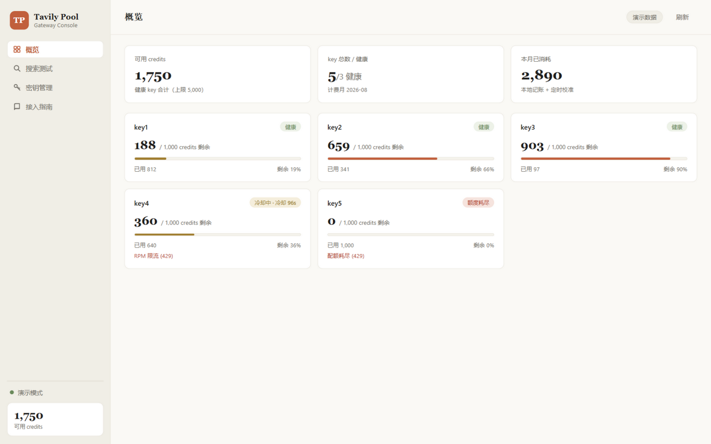

# Tavily Pool Gateway

**EN** | [中文](#中文)

> Pool multiple Tavily API keys behind one endpoint. Automatic rotation, circuit breaking, and credit accounting — when one account's monthly quota runs out, the next key takes over seamlessly. Ships with a web console and a Tauri desktop app.



---

<div id="中文"></div>

## 这是什么

一个可以把多个Tavily账号的api转换为一个地址的项目。**Tavily Pool Gateway** 把你手上的多个 Tavily 账号 key 池化成一个服务：

- **一个地址接入**：HTTP（兼容 Tavily 官方 API，SDK 改个 base_url 就能用）或 MCP（AI 客户端直接连）
- **自动轮询**：额度最多的 key 优先；某个账号用完自动切换下一个，跨月自动恢复
- **熔断保护**：连续限流自动冷却、无效 key 自动禁用、403 风控自动恢复
- **精确记账**：每次请求从响应读取真实消耗，每小时与官方 `/usage` 校准
- **Web 控制台 + 桌面应用**：浏览器打开 `/ui/` 或用 Tauri 壳，监控额度、测试搜索、添加 key

## 核心特性

| 能力 | 说明 |
|---|---|
| 多 key 池化 | 逗号分隔或 `api.txt` 每行一个，运行时热添加（自动持久化 + 立即校准额度） |
| 端点兼容 | `/v1/search` `/v1/extract` `/v1/crawl` `/v1/map` `/v1/research`，与官方 API 同构 |
| MCP Server | `/mcp/`（streamable-http），7 个工具：`tavily_search` / `tavily_extract` / `tavily_crawl` / `tavily_map` / `tavily_research` / `tavily_get_research` / `tavily_pool_status` |
| 安全防护 | 自动剥离请求体中的 `api_key`（防止客户端误配置覆盖池内 key 导致全池熔断） |
| 异步研究 | research 任务透传（201 创建 / 202 轮询 / 200 完成），网关维护任务与 key 的映射 |
| 轻量 | 单进程 Python，运行内存约 60–100MB，无数据库 |

## 快速开始

### 1. 启动网关

```bash
git clone https://github.com/YOUR_NAME/tavily-pool-gateway.git
cd tavily-pool-gateway

python -m venv .venv
.venv/bin/pip install -r requirements.txt        # Windows: .venv\Scripts\pip install -r requirements.txt

# 配置 key（二选一）
echo "tvly-your-key-1" >> api.txt                 # 方式 A：api.txt 每行一个
# TAVILY_KEYS=tvly-key-1,tvly-key-2               # 方式 B：环境变量逗号分隔

.venv/bin/python -m uvicorn app:app --host 0.0.0.0 --port 8000
```

打开 `http://localhost:8000/ui/` 即是控制台。

> 没有 key？到 [tavily.com](https://tavily.com) 免费注册，每账号每月 1000 credits。

### 2. 接入

**HTTP（SDK 兼容）**：

```python
from tavily import TavilyClient
client = TavilyClient(api_key="any", base_url="http://localhost:8000/v1")
client.search("hello")
```

**MCP（AI 客户端）**：在支持 MCP 的客户端（Codex / Hermes / Cursor 等）添加：

```
http://localhost:8000/mcp/
```

### 3. 桌面应用（可选）

```bash
cd desktop/src-tauri
npx @tauri-apps/cli build
```

安装包输出在 `target/release/bundle/`。桌面壳启动时自动探测网关（默认 `http://127.0.0.1:8000`，可用环境变量 `TAVILY_GATEWAY_URL` 指定远程地址）；未启动时显示连接指导页。

也可以直接从 [Releases](../../releases) 下载安装包（GitHub Actions 在打 tag 时自动构建 Windows / macOS / Linux 三平台）。

## 部署到服务器（systemd）

```bash
# 服务器上
sudo cp deploy/tavily-juhe.service /etc/systemd/system/
# 按需修改单元内的 WorkingDirectory / ExecStart / --host（建议绑定内网网卡 IP，勿用 0.0.0.0 暴露公网）
sudo systemctl daemon-reload && sudo systemctl enable --now tavily-juhe
```

## API 摘要

| 方法 | 路径 | 说明 |
|---|---|---|
| POST | `/v1/search` `/v1/extract` `/v1/crawl` `/v1/map` | 与 Tavily 官方 API 同构，key 由网关注入 |
| POST | `/v1/research` | 创建深度研究任务（异步） |
| GET | `/v1/research/{request_id}` | 查询任务状态（202 进行中 / 200 完成） |
| GET | `/v1/usage` `/admin/pool` | key 池额度与状态（零 credits 消耗） |
| POST | `/admin/keys` | 热添加 key：`{"keys": ["tvly-..."]}` |
| GET | `/health` | 存活检查 |
| GET | `/ui/` | Web 控制台 |
| POST | `/mcp/` | MCP streamable-http 入口 |

## 架构

```
调用方（SDK / MCP 客户端 / Web 控制台）
        │
        ▼
┌─────────────────────────────────────┐
│  Gateway (FastAPI, 单进程)           │
│  ├─ gateway.py   HTTP 路由 /v1 /admin│
│  ├─ mcp_server.py MCP 工具 (7 个)    │
│  ├─ keypool.py   key 池核心          │
│  │   ├─ 状态机 healthy/cooling/     │
│  │   │          exhausted/disabled  │
│  │   ├─ 选 key：剩余额度优先          │
│  │   ├─ 记账：usage.credits + 校准   │
│  │   └─ 防护：剥离 body api_key      │
│  └─ webui/       Web 控制台          │
└─────────────────────────────────────┘
        │  轮询转发（Authorization: Bearer）
        ▼
  Tavily 官方 API（多账号）
```

## 注意事项

- **鉴权**：默认无鉴权，设计为跑在可信内网（如 Tailscale）。如需暴露，设置环境变量 `GATEWAY_TOKEN`，调用方带 `Authorization: Bearer <token>`。
- **合规**：请聚合自己真实持有的账号。批量注册免费账号薅额度有封号风险。
- **`api.txt` 含真实 key**，已在 `.gitignore` 中，请勿提交或分享。
- 本项目全为vibecoding，属于个人使用分享，可能体验等各个方面都有问题或bug，还望海涵。

## License

[MIT](LICENSE)
